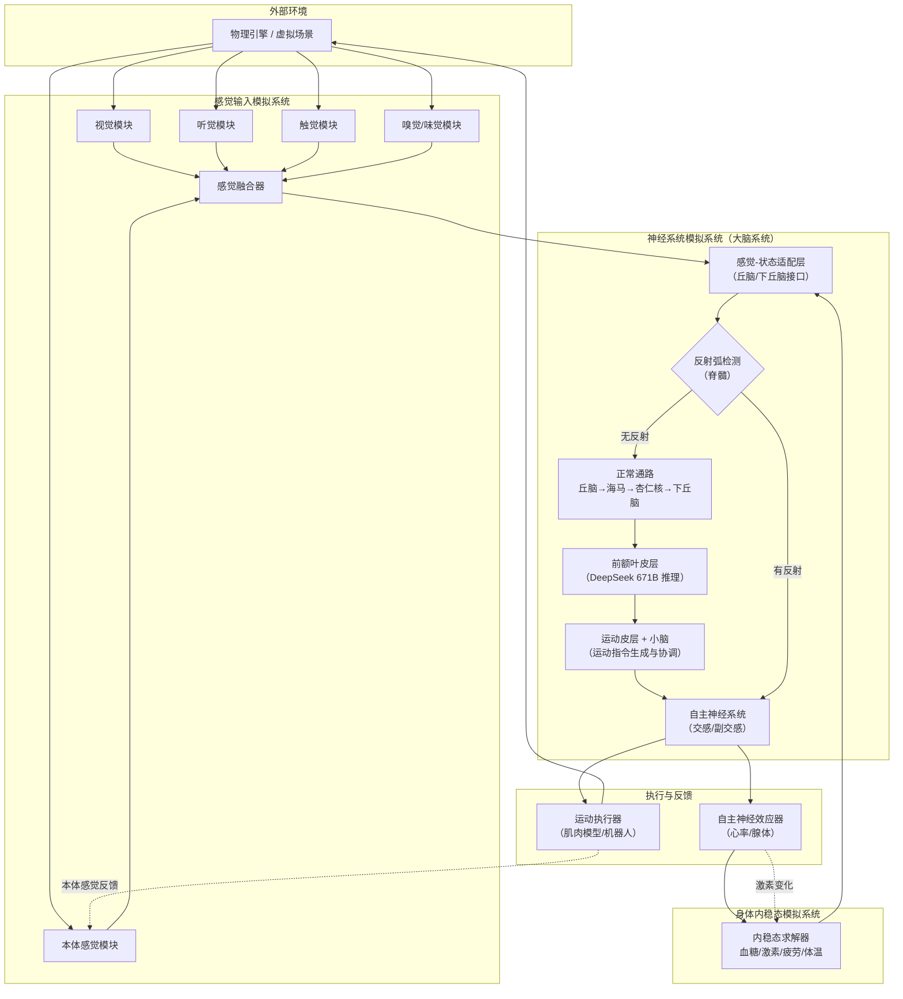

# 🧠 Sunaookami Shiroko — 生物神经系统模拟平台

[](https://www.python.org/downloads/)
[](https://langchain-ai.github.io/langgraph/)
[](LICENSE)

**Sunaookami Shiroko** 是一个高保真生物神经系统模拟平台，将人类神经系统的主要构造（中枢+周围神经系统）映射为多智能体系统，并接入独立的**感觉输入模拟系统**和**身体内稳态模拟系统**，实现认知、反射、记忆、情感与生理状态的闭环交互。

> 项目代号取自“砂狼白子”，寓意冷静、精准的神经反射与计算。

---

## ✨ 核心特性

- 🧬 **完整的神经模拟** — 脊髓反射、丘脑感觉中继、海马记忆、杏仁核情绪、前额叶决策、运动皮层与小脑协调、自主神经调节
- 🤖 **多 LLM 异构计算** — 本地 GPT‑OSS 120B（低延迟实时任务）+ DeepSeek 671B × 2（高级推理与记忆系统）
- 🔁 **闭环交互** — 感觉输入 → 大脑处理 → 运动/自主神经输出 → 身体状态变化 → 感觉更新
- ⚡ **反射弧短接** — 危险信号（高温、强光）在脊髓级直接触发运动，延迟 <15ms
- 🧠 **内稳态与情绪影响决策** — 血糖、疲劳、肾上腺素、疼痛、饥饿等状态动态影响认知
- 💾 **完整状态持久化** — 支持将神经系统、感觉、内稳态的全部状态保存为 JSON/YAML 快照，可随时恢复模拟
- 🌐 **解耦的子系统通信** — 基于 Redis Pub/Sub + Protocol Buffers，支持分布式部署

---

## 🏗️ 系统架构（数据流）



---

## 🚀 快速开始

### 1. 环境要求

- **硬件**（推荐）：
  - GPU: 4× A100 80GB（用于 GPT‑OSS 120B 本地推理）
  - CPU: 32 核，RAM: 256GB
- **软件**：
  - Python 3.10+
  - Redis 5.0+
  - CUDA 11.8+（如使用 GPU）

### 2. 安装

```bash
git clone https://github.com/yourname/Sunaookami_Shiroko.git
cd Sunaookami_Shiroko
pip install -r requirements.txt
```

### 3. 配置

复制环境变量模板并填写 DeepSeek API 密钥：

```bash
cp .env.example .env
# 编辑 .env，填入 DEEPSEEK_API_KEY_1 和 DEEPSEEK_API_KEY_2
```

### 4. 启动各子系统

```bash
# 启动 Redis
redis-server

# 启动本地 GPT‑OSS 120B 服务（vLLM）
bash scripts/start_vllm.sh

# 启动感觉模拟器（新终端）
python sensory/simulator.py

# 启动内稳态模拟器（新终端）
python homeostatic/simulator.py

# 启动大脑系统主循环（新终端）
python brain/brain_system.py
```

### 5. 运行示例场景

```bash
# 测试“碰到热锅”反射场景
python tests/test_reflex_scenario.py
```

---

## 📁 项目结构

```
Sunaookami_Shiroko/
├── docs/                  # 详细设计文档
├── proto/                 # Protocol Buffers 定义
├── sensory/               # 感觉输入模拟系统
├── homeostatic/           # 身体内稳态模拟系统
├── brain/                 # 神经系统核心（LangGraph 多智能体）
│   ├── nodes/             # 各脑区节点实现
│   ├── llm/               # 模型接入层（LiteLLM Router）
│   └── adapter.py         # 消息适配层
├── snapshot/              # 状态快照管理（保存/恢复）
├── scripts/               # 启动脚本
├── tests/                 # 单元测试与集成测试
└── README.md
```

---

## 🧩 关键节点与 LLM 分配

| 节点 | 模拟脑区 | LLM / 方法 |
|------|----------|-------------|
| `spinal_reflex` | 脊髓反射弧 | 规则（无 LLM） |
| `thalamus_relay` | 丘脑 | 注意力路由（无 LLM） |
| `hippocampus_memory` | 海马体 | DeepSeek 671B (chat) |
| `amygdala_emotion` | 杏仁核 | GPT‑OSS 120B |
| `prefrontal_cortex` | 前额叶皮层 | DeepSeek 671B (reasoner) |
| `motor_cortex` | 初级运动皮层 | GPT‑OSS 120B |
| `cerebellum_coordination` | 小脑 | 逆运动学函数 |
| `autonomic_nervous` | 自主神经系统 | 规则 + LLM 反馈 |

---

## 💾 状态保存与恢复

系统支持将完整的内部状态（大脑 + 感觉 + 内稳态）保存为本地 JSON/YAML 文件，便于复盘、调试或从中断点恢复。

```python
from snapshot import SnapshotManager

manager = SnapshotManager(save_dir="snapshots")
manager.save_full_state(brain_state, sensory_state, homeostatic_state)
manager.load_full_state("snapshots/snapshot_20260523_120000.json")
```

自动保存（间隔可配置）已集成在主循环中。

---

## 📈 性能指标

| 指标 | 目标值 |
|------|--------|
| 反射弧延迟 | <15 ms |
| 高级认知延迟 | 200–500 ms |
| 吞吐量 | 10 次决策/秒 |
| 内存占用 | <200 GB（含模型权重） |

---

## 🤝 贡献

欢迎提交 Issue 和 Pull Request。请确保通过所有单元测试：

```bash
pytest tests/
```

---

## 📄 许可证

MIT © Sunaookami Shiroko Team

---

## 📚 详细文档

完整的系统设计、API 参考、部署指南和扩展说明请参阅 [docs/](./docs/) 目录下的 [完整文档](docs/README.md)。

---

## 🌟 Star 历史

[](https://star-history.com/#yourname/Sunaookami_Shiroko&Date)
```

该文本符合 GitHub Markdown 规范，代码块、表格、Mermaid 流程图均使用正确语法。
