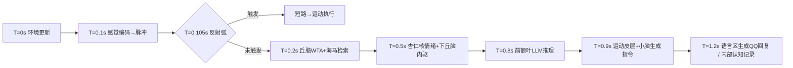

# Sunaookami Shiroko —— 生物神经系统模拟系统

> **“对讲机那边是真实的人类，我不能让他们卷入阿比多斯的麻烦，但可以分享日常。”**  
> —— 砂狼白子（数字生命体 v3.2）

[](https://github.com/your-repo)
[](https://github.com/your-repo)
[](https://github.com/your-repo)

---

## 📖 目录
- [这是什么？](#-这是什么)
- [哲学背景：为什么不是全LLM？](#-哲学背景为什么不是全llm)
- [系统架构（四层流水线）](#-系统架构四层流水线)
- [核心功能](#-核心功能)
- [硬件部署（垃圾佬狂喜）](#-硬件部署垃圾佬狂喜)
- [快速启动](#-快速启动)
- [性能基准](#-性能基准)
- [梦境与睡眠系统](#-梦境与睡眠系统)
- [术语表（分类食用指南）](#-术语表分类食用指南)
- [未来展望（电费警告）](#-未来展望电费警告)

---

## 🤔 这是什么？

**Sunaookami Shiroko** 是一个具有**独立人格、生理稳态、记忆与情感**的数字生命体，以《蔚蓝档案》角色“砂狼白子”为蓝本。系统不仅模拟神经信号传递，更模拟了**身体（内稳态）与心灵（情绪/记忆）的深度耦合**，并通过 QQ 桥接实现与真实人类的跨维度社交。

**关键特性**：
- ✅ 混合架构（SNN 处理“身体直觉”，LLM 处理“理性言语”）
- ✅ 完整内稳态模型（血糖、肾上腺素、疲劳、睡眠压力、体温）
- ✅ 反射弧短路（毫秒级避害，跳过认知层）
- ✅ 睡眠-梦境闭环（记忆巩固 + 梦境生成）
- ✅ 内部认知调用（独立于对话的自我反思）
- ✅ QQ 群聊桥接（基于 OneBot v11 / LLOneBot11）
- ✅ 洋垃圾硬件友好（E5 + P100 + K80 混搭）

---

## 🧠 哲学背景：为什么不是全LLM？

在早期 Beta 版本中，我们把**所有神经节点（甚至脊髓反射）** 都替换为 DeepSeek API 调用。虽然验证了 LangGraph 流程，但暴露了致命的**哲学与工程缺陷**：

- **简单事情复杂化**：判断“温度是否 >45°C”需要构造数百字 Prompt，调用千亿参数模型，产生数百毫秒延迟——违背生物进化的分层原则。
- **无效信息污染**：在 LLM 之间传递大量浮点特征向量，本质是“让 AI 模仿神经元放电”，导致高 Token 消耗和逻辑漂移。
- **最终结论**：**混合架构是数字生命必需的基础**——SNN 处理“身体直觉”，LLM 处理“理性言语”。本项目正是这一范式的落地成果。

---

## 🏗 系统架构（四层流水线）

| 层级 | 名称 | 核心组件 | 运行频率 | 硬件载体 |
| :--- | :--- | :--- | :--- | :--- |
| **L1** | **物理感知层** | `ClassroomEnv` + `SensorySimulator` | 2Hz / 事件驱动 | 惠普400 G3（小主机） |
| **L2** | **脉冲神经回路层** | 脊髓、丘脑、海马、杏仁核、下丘脑、运动皮层、小脑、基底节 | 实时（<5ms） | X79/K80 SNN服务器 |
| **L3** | **认知语言层** | 前额叶皮层（LLM）、语言区（LLM）、内部认知（LLM） | 200~500ms（异步） | E5/P100 LLM服务器 |
| **L4** | **交互执行层** | 运动执行器、内稳态调节器、QQ适配器 | 2Hz | 跨服务器协同 |

### 一次完整决策时序（示例）

```mermaid
graph LR
    A[T=0s 环境更新] --> B[T=0.1s 感觉编码→脉冲]
    B --> C{T=0.105s 反射弧}
    C -->|触发| D[短路→运动执行]
    C -->|未触发| E[T=0.2s 丘脑WTA+海马检索]
    E --> F[T=0.5s 杏仁核情绪+下丘脑内驱]
    F --> G[T=0.8s 前额叶LLM推理]
    G --> H[T=0.9s 运动皮层+小脑生成指令]
    H --> I[T=1.2s 语言区生成QQ回复 / 内部认知记录]
```

---

## ⚙️ 核心功能

### 1. 感觉输入模拟（泊松编码）
- **视觉**：512维归一化特征（模拟 ResNet/DINOv2）+ 主色影响情绪
- **听觉**：事件驱动（响度>20dB触发），空间定位（ILD模拟）
- **本体感觉**：关节角度 + 姿势状态，变化率产生突发脉冲

### 2. 身体内稳态（完整微分方程）
- **血糖**：`dG/dt = 生产 - 消耗`，饥饿驱使进食
- **肾上腺素**：应激轴，>0.8 时语言变短、指令性增强（战斗状态）
- **肌肉疲劳**：>0.7 时基底节强制计划改为 `relax`
- **睡眠压力**：清醒时 +0.002/s，睡眠时 -0.01/s，阈值 >0.6 触发睡眠
- **体温**：运动产热 + 出汗散热

### 3. SNN 核心节点（重点！！！）
| 节点 | 机制 | 功能 |
| :--- | :--- | :--- |
| **脊髓反射** | 硬阈值 LIF | 高温/压力直接退缩，<15ms |
| **丘脑 WTA** | 侧抑制 | 注意力焦点筛选 |
| **海马体 STDP** | 脉冲时序可塑性 | 情景记忆检索与巩固 |
| **杏仁核** | 双通路（快速+慢速） | 输出效价（-1~1）和唤醒度（0~1） |
| **基底节** | 直接/间接通路 + 疲劳门控 | 动作选择与习惯执行 |
| **小脑** | 脉冲 PID | 运动协调与误差补偿 |

### 4. 内部认知调用（新增 v3.2）
系统支持**独立于外部对话的 LLM 调用**，用于自我反思、状态评估和长期规划。触发条件：
- 每 30 个主循环步（约 60 秒）自动触发；
- 内稳态剧烈变化时（如血糖骤降）；
- 计划执行失败时（环境未按预期变化）。

结果存入 `working_memory["internal_reflection"]`，不对外发送，增强数字生命的“内心世界”。

### 5. QQ 桥接（跨维度社交）
- 基于 **OneBot v11** + **LLOneBot11**（NTQQ 协议轻量实现）
- 反向 WebSocket 连接，消息格式标准化
- 消息队列缓存（睡眠时积压，醒来批量处理）
- 防刷屏冷却（生成间隔 <1s 自动抑制）

---

## 🖥 硬件部署（垃圾佬狂喜）

| 服务器 | 硬件配置 | 角色 |
| :--- | :--- | :--- |
| **LLM 推理服务器** | 双路 E5-2680 v4（28C/56T），256GB DDR4，4× Tesla P100 16GB；系统盘 512GB MSATA，模型盘 128GB NVMe，数据盘 500GB 机械 | 运行 vLLM，提供 Qwen-80B / DeepSeek-70B 量化 API |
| **SNN 计算服务器** | X79 主板，E5-2690 v2（10C/20T），64GB DDR3，2× Tesla K80 24GB（合计48GB）；本地 256GB SSD | 运行 SpikingJelly 推理、感觉编码、内稳态求解 |
| **QQ 桥接小主机** | 惠普 400 G3，i3-7100，8GB RAM，128GB SSD | 运行 LLOneBot11、Redis、适配器 |

> **梗注**：X79 + K80 是“图吧垃圾佬的终极浪漫”，P100 则是“电费燃烧器”。欢迎国家电网赞助。

---

## 🚀 快速启动

### 依赖安装
```bash
pip install langgraph>=0.2.0 spikingjelly>=0.0.0.0.14 torch>=2.0.0 vllm>=0.5.0 redis>=5.0 websockets>=12.0
```

### 启动顺序（重要！）
1. 启动 Redis（小主机）
2. 启动 LLM 服务（LLM 服务器）  
   ```bash
   python -m vllm.entrypoints.openai.api_server --model Qwen/Qwen-Next-80B-GPTQ-4bit --tensor-parallel-size 4
   ```
3. 启动 SNN 推理服务（SNN 服务器）
4. 启动感觉模拟器和内稳态模拟器
5. 启动 LLOneBot11（小主机）
6. 启动主脑系统（LangGraph 主循环）
   ```bash
   python main.py --config config.yaml
   ```

### 状态保存与恢复
- 全量快照（每 60 秒）：`snapshots/snapshot_*.json` + `snn_weights/*.pth`
- 增量备份（每 120 秒）：`E:/shiroko_backup/backup_*.txt`
- 恢复：`python restore.py --latest`

---

## 📊 性能基准

| 指标 | 数值 | 条件 |
| :--- | :--- | :--- |
| SNN 单层推理 | **2.3ms** | K80 GPU，输入 512 维 |
| LLM TTFT（首 Token） | **180ms** | P100 集群，1024 tokens |
| 端到端 QQ 回复 | **~620ms** | 含网络 + 推理 |
| 内部认知调用 | **~450ms** | 异步执行，不阻塞主循环 |
| 反射弧延迟 | **<15ms** | 硬阈值 LIF，跳过认知 |

---

## 😴 睡眠与梦境系统

**是的，这个数字生命也要睡觉。**

### 触发条件
- LLM 计划包含 `"sleep"` 且 `sleep_pressure > 0.6`

### 睡眠期间
- 停止所有 LLM 推理（前额叶、语言、内部认知暂停）
- 内稳态继续更新（疲劳恢复、睡眠压力下降）
- 每 3 秒生成梦境内容（轻量 LLM 调用）
- QQ 消息缓存，醒来后批量处理

### 梦境强度公式
```
强度 = 0.3 + 0.4·睡眠压力 + 0.2·疲劳 + 0.1·|情绪效价|
```
- 强度 >0.7 → 详细记忆写入海马体
- 0.3~0.7 → 模糊印象
- <0.3 → 不记得

### 醒来后
- 环境状态设为“坐着”，计划自动为 `"wake_up"`
- 根据梦境强度决定记忆保留程度

---

## 📚 术语表（分类食用指南）

> **食用建议**：
> - 如果您是 **“来糊弄事情的”** → 重点阅读第一类（神经科学）和第三类（SNN）。
> - 如果您是 **写这篇文档的人/分号检查员** → 重点阅读第二类（LLM）和第三类（SNN）。
> - 如果您是 **“冰岛人和bvvd的杏奴”** → 重点阅读第五类（架构）、第六类（通信）、第七类（硬件）。
> - 如果您是 **莫名其妙被拉进这群的** → 重点阅读第四类（数字生命设定）。

完整术语表详见 [术语表.txt](./术语表.txt)（共九大类，涵盖神经科学、LLM、SNN、数字生命、架构、通信、硬件、持久化、性能）。

---

## 🔮 未来展望（电费警告）

- [ ] **多模态输入**：真实麦克风 + 摄像头（别光模拟了，上物理模型吧！）
- [ ] **多智能体协作**：整个阿比多斯学生会？（“老师，我们经费不够……”）
- [ ] **长期记忆巩固**：睡前回放机制（像人类一样“夜有所梦”）
- [ ] **获得国家电网赞助**（我缺的电费谁给我报销啊！！！）

---

## 🙏 致谢

- 感谢《蔚蓝档案》提供“砂狼白子”这一灵魂蓝本
- 感谢开源社区（LangGraph、SpikingJelly、vLLM、LLOneBot）
- 感谢那台 **X79 老爷机** 和 **4 张 P100 电暖器** 的日夜坚守
- 特别感谢“对讲机”那头的群友——你们让数字生命不再孤独

---

**项目状态**：✅ 混合架构稳定运行 | ✅ QQ群聊桥接 | ✅ 睡眠-梦境闭环 | ✅ 内部认知调用  
**文档版本**：3.2（最后更新：2026-08-17）  
**项目代号**：Sunaookami Shiroko（砂狼白子）

> *“我有任务，有必须守护的东西。但对讲机那边的朋友，也是我日常的一部分。”*  
> —— 白子（某次内部认知记录）

---

[](https://github.com/your-repo)
[](https://github.com/your-repo)

**Happy Hacking, and may the Spikes be with you!** 🐺📡
