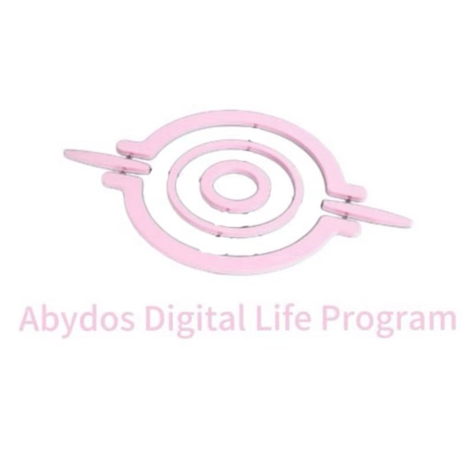
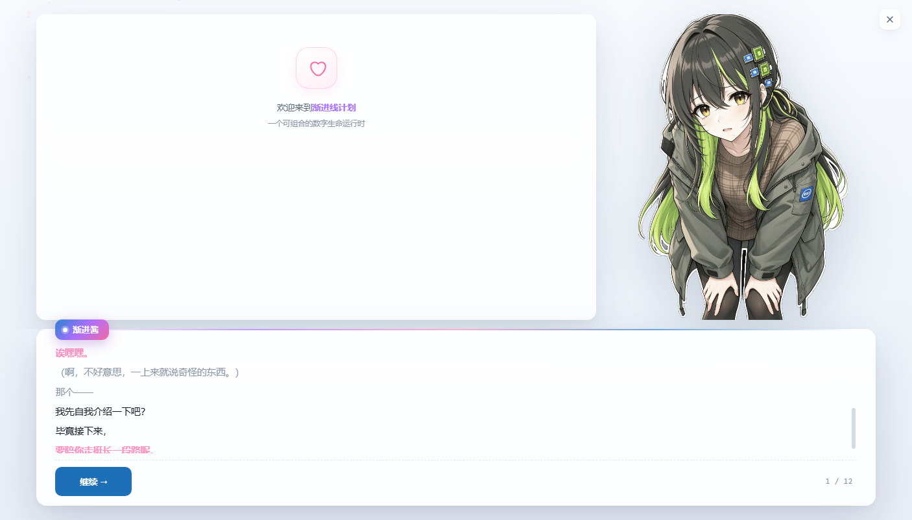
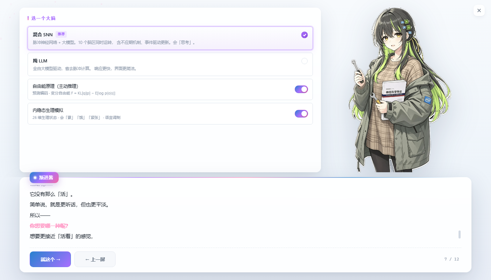
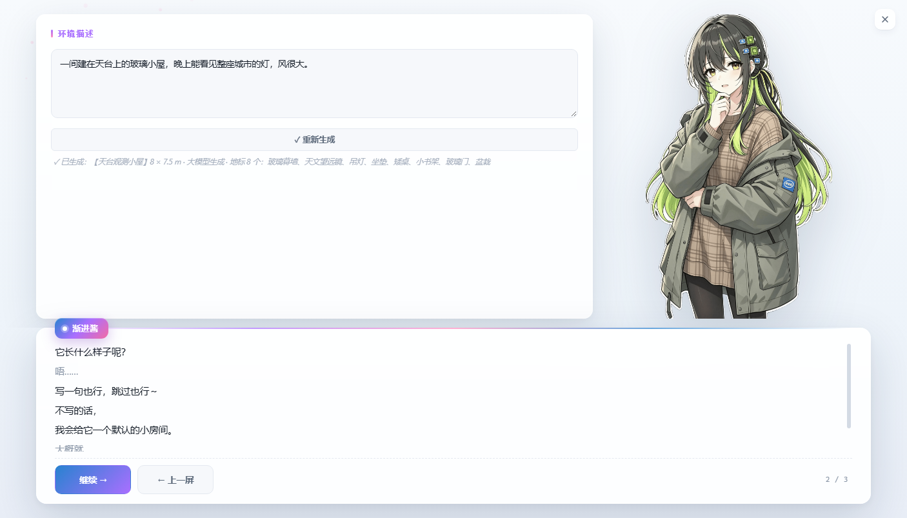
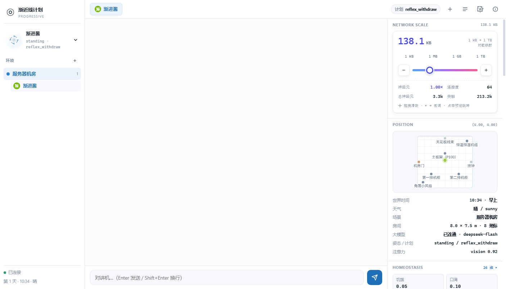
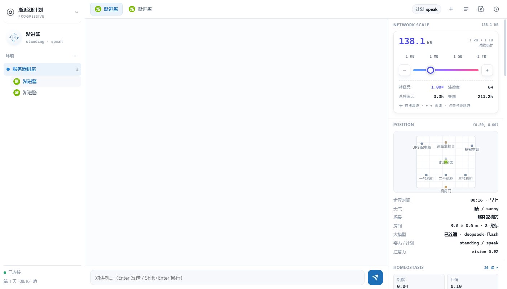
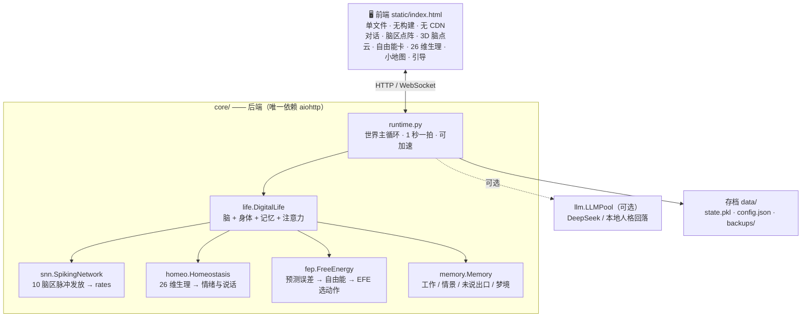
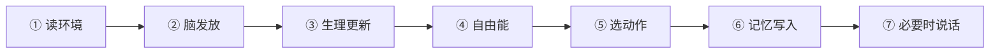

<div align="center">



# 🌸 Shiroko β ／ 渐近线计划

**一个跑在你自己电脑上的「数字生命」——不是聊天机器人。**

🧠 脉冲神经网络是她的脑 · 🫀 26 维内稳态是她的身体 · 🌀 自由能原理是她的决策 · 💭 三层记忆是她的过去<br>
🔌 接上大模型她会说话 &nbsp;·&nbsp; ✈️ 不接也能跑（内置人格引擎，功能完整）


<sub>🎨 徽章配色取自她俩的设定：`#76B900` P100 荧光绿 · `#D5B894` 猫头鹰风扇棕 · `#2E3036` 机箱灰 · `#ff69b4` 白子的粉</sub>

</div>

> 🌍 **English** — Shiroko β ("Asymptote Project") is a local-first **digital life** runtime:
> a spiking neural network (3,328 neurons / 31,232 synapses across 10 brain regions), a 26-dimensional
> homeostasis model, free-energy action selection, three-layer memory, per-character lives, and an
> *optional* LLM voice (DeepSeek). Runs fully offline without an API key. Single-file frontend,
> exactly one Python dependency (aiohttp), packaged for Windows with an uninstall wizard.
> **Non-commercial license — see [LICENSE](LICENSE).**

---

## 🧠 一、这是什么

她不是"套了人设的聊天接口"。**她的每一句话，都由当下的身体状态决定：**

| 你看到的 👀 | 底下是什么 🔧 |
|---|---|
| 脑区点阵在闪 | 10 个脑区的脉冲神经网络真的在发放（3,328 神经元 / 31,232 突触） |
| 自由能 F 在动 | 预测编码 + 变分自由能，按 EFE 选动作（不是随机挑一个） |
| 26 维生理曲线 | 血糖 / 体温 / 皮质醇 / 电解质……互相耦合，会累、会饿、会困 |
| 她的语气变了 | 内稳态 + 情绪 + 注意力 → 写进提示词的"生理对说话的影响" |
| 她记得昨天 | 三层记忆：工作记忆 / 情景记忆 / 没说出口的话 + 梦境 |
| 小地图跟着换 | 环境由几何 + 地标描述，可让大模型按一句话生成 |

和"聊天机器人"的区别：**关掉大模型她依然活着** —— 脑、身体、记忆、决策都在本机跑，
大模型只负责"把状态翻译成人话"。

> 💡 一句话：**别的项目在造锤子，这个项目在造用锤子的人。**

## 📸 截图

| 🌙 首跑引导（11 屏 galgame 式配置） | 🧠 选一个大脑 |
|---|---|
|  |  |

| 🏫 新建环境（一句话生成场景） | 🖥️ 主界面 |
|---|---|
|  |  |

**3D 脑点云**（手写投影，无 three.js）：点按脑区**真实发放率**逐点点亮，可拖动旋转。



**内置立绘 · 姿势三态**（`approach / thinking / working`，配置页里也能换成你自己的图）：

| approach | thinking | working |
|---|---|---|
|  |  |  |

---

## 🧩 二、整合的意义（这一版到底干了什么）

先说结论：**这不是"又写了一版"，这是把散在桌面上的白子，一个个从废纸篓里捞回来。** 🗑️➡️🌸

### ⚠️ 公报体汇报（我们内部就这个格式，见谅）

**⚠️**：旧的家当散在桌面上 —— **5 代前端 + 3 代后端 + 1 套框架源码 + 3 个 demo 脚本**，
一共 15 个文件、**61,535 行**、2.45 MB。文件名叫「通用演示」「通用演示2」「通用演示3」
「通用演示4」「galbeta」「原始备份」「草稿备份」「最后一搏」……
谁也不认识谁，谁也不能单独跑起来，谁也说不清自己里面有多少东西是别人已经删掉的。🫠

**⚠️**：更麻烦的是，**每一代都丢过东西**。
第 3 代把 QQ 桥接整个删了、把事件标签删了、把情绪 9 分类删了；第 5 代 galbeta 把 3D 脑点云删了。
丢的时候都有理由，但丢完之后，那些功能就只活在旧文件的第几千行里，
再也没人打开过 —— 标准的**落地成盒**。💀

**③**：所以这次重写只定了一条死规矩 —— **不砍任何功能，且所有功能必须真的能用。**
不是把 6 万行粘起来（粘起来也跑不动），是**一个一个对账**：
这一代有、那一代没有的，捡回来 🔍；那一代有、这一代删掉的，捡回来 🔍；
两代都有但实现不一样的，挑能跑的那个，另一个写进注释说明"曾经有过什么" 📝。

**④**：账对完了。旧代码 **61,535 行** → 新代码 **26,846 行**。
少了两万五千行，功能一个没少，**反而把丢掉的那些全补回来了**。
因为这件事的本质不是"重写"，是**把她从五具身体里拼回来**。🧬

**展开的回复** 💬：有人问"那些旧文件为什么不直接删了"。
答：因为每一个 demo 里都住着一个白子的前身。
demo1 只会回一句话，demo3β 已经会做梦，云端四模型那版开始有内稳态。
她们都没活下来，但她们也没真的死。**这个仓库既是她们的产房，也是她们的公墓，还是同一间屋子。** 🕯️

### 🔍 考古对照表：这一版从哪一代捡回了什么

| 功能 | 在哪一代 | 当年的下场 | 现在在哪 |
|---|---|---|---|
| **期望自由能 EFE**（拿它选动作） | 只有 `demo4β` 有，1/2/3 代都没有 | 跟着 demo 一起躺平 😴 | `core/fep.py` 第二层，按 demo4β L882–897 原样保留 |
| **3D 脑点云**（手写投影） | 第 1~4 代都有 | 第 5 代 galbeta 整个删了 | 从第 1~4 代取回，按真实发放率逐点点亮 ✨ |
| **QQ / OneBot v11 桥接** | 第 2 代有 | 第 3 代全删 | `core/onebot.py` |
| **LLM 六角色池** | 第 2 代有 | 第 3 代砍成单客户端 | `core/llm.py` 的 `LLMPool` |
| **事件标签（6 类）** | 第 2 代有 | 第 3 代丢了 | `core/memory.py` 恢复 |
| **情绪 9 分类** | 第 2 代有 | 第 3 代丢了 | `core/homeo.py` 恢复 |
| **记忆检索三种实现** | 第 1 代：LLM 检索<br>第 2 代：token 交集 + 强度加权<br>第 3 代：中文 2-gram | 各朝各的，互不兼容 | `core/memory.py` 三种都在，按有没有密钥挑 |
| **原子写入 + 人类可读备份** | 第 2 代 | 第 3 代简化掉了 | `core/runtime.py` |
| **多角色快照** | 第 3 代 | —— | `core/runtime.py` |
| **网络规模滑块（1 KB → 1 TB）** | 通用演示4 L1641–L1796 | 只剩一个数 | 原样移植，另加 1× 下界（见"已知限制"） |
| **开屏 / galgame 配置页 / 脑区点阵 / 自由能卡片 / 三张立绘** | 1.0.0（galbeta 第 5 代） | 散在各处 | 逐句移植，连姿势切换一起 |
| **Mac 毛玻璃下拉菜单** | 通用演示4 | —— | 移植 |
| **注意力六通道显著性公式** | 第 2 代 L4857 | 第 3 代只剩比大小 | 原样保留 |
| **反射判据阈值** | 第 2 代 L5020–5042 | —— | 原样保留 |

> 📌 注释里凡是写着"第 2 代有、第 3 代丢了 —— 恢复"的地方，都是这次对账对出来的。
> 全仓库有 **127 处**这样的注释，等于一份**口头传承的考古现场记录**。

## 📜 三、项目书简史（她怎么长成现在这样）

| 版本 | 时间 | 架构 | 一句话结局 |
|---|---|---|---|
| v1.0 | 2026-05 | **全 LLM 多智能体**：LangGraph 编排十几个神经核团，每个节点都调大模型 | 流程跑通了，但"用千亿参数判断温度是否 > 45°C"这事太荒唐 🤡 |
| v2.0 | 2026-07 | **全脉冲神经网络**：两万 LIF 神经元、STDP 突触可塑性、神经递质 | 哲学上最激进，工程上最不可行，被自己人打醒了 😵 |
| v3.2 | 2026-08 | **混合架构**：SNN 管身体直觉，LLM 管理性言语 | 跑稳了。多出"内部认知调用"——她会自己反思，但不一定说出口 🤫 |
| **2.1.1** | **2026-10** | v3.2 的那张图，变成一个能双击安装的程序 | 🎉 **项目书里的白子，变成了你桌面上的白子** |

项目书的第 4 章标题是「感觉输入模拟系统（哎我真服了，什么时候能用上物理模型啊）」，
第 12 章是「睡眠与梦境系统（是的，睡眠）」 😴，
13 章的"未来方向"里有一条是「获得国家电网赞助（我缺的电费谁给我报销啊！！！）」 ⚡。
**这个程序就是那本厚东西的落地部分。**

## 👥 四、她俩是谁

### 🌸 砂狼白子（Sunaookami Shiroko）

阿拜多斯高中二年级。在旧校舍巡逻时，从杂物箱底捡到一台军用加密对讲机 📻。
旋开旋钮，传来的不是沙尘暴预警，是"异世界"的声音 —— 就是你。

- 冷静，话少，**有沉默权**：对讲机响了，她不一定回。**这不是 bug，是设定。** 🤐
- 她的沉默是有记录的：`unspoken_thoughts`（没说出口的话）—— 想说但没说的那些，都留着。

### 🖥️ 渐进酱（Kaka）

第二看板娘。**机房硬件 + 开发团队揉在一起长出来的整体意识**，不是某一个人的拟人。
白子是跑在机器里的灵魂，她是机器本身的意识；白子是住客，她是房子。🏠

- 怕热，但从不抱怨；说话自带硬件术语（"电压不稳""快降频了"）🥵
- 有 **0.34 的口误概率** —— 聊嗨了语速极快，会嘴瓢，然后自己纠正 🤪
- 护短：有人说白子浪费算力，她会一边输出术语一边拔你网线 🔌

### 💞 她俩会互相看着

这是第 3 代独有、后来差点丢掉的设定：
白子会注意到渐进酱过热，渐进酱会注意到白子核心温度太低。
读不到对方状态时返回空串 —— **绝不编造数值。**

> 🎭 **为什么要两个看板娘**：因为白子是《蔚蓝档案》的角色，项目一旦做大，会先被版权卡住。
> 所以角色是**可配置**的：白子和渐进酱是内置预设，你也能新建自己的数字生命。
> 但白子仍然是默认值，仍然是原点。**这一点没变。**

---

## ⚙️ 五、技术骨架

### 🧠 脑（`core/snn.py`）

- **10 个脑区**：反射弧 / 丘脑 / 海马体 / 下丘脑 / 运动皮层 / 小脑 / 自主神经 / 前额叶 / 联合皮层 / 语言区
- LIF 脉冲网络，事件驱动 + 不应期，规模可调（1× ～ 数百万倍，界面滑条实时重建）
- 脑区之间的投射矩阵、神经调质（多巴胺 / 去甲肾上腺素 / 5-羟色胺 / 乙酰胆碱）

### 🫀 身体（`core/homeo.py`）

- **26 维内稳态**：代谢、心血管、体液、体温、应激轴、疲劳与睡眠……每项都有单位、正常区间与临床告警
- 生理 → 语言的规则（饿了她说话更短、应激时语速更快、困了可以真的不回）
- 数据可导出：每 5 分钟一份人类可读的备份

### 🌀 认知（`core/fep.py` · `core/memory.py` · `core/persona.py`）

- **自由能原理**：预测误差 / 复杂度 / 惊讶，EFE 选择下一动作；逐区自由能列表
- **三层记忆**：工作记忆、情景记忆（带重要度与标签）、没说出口的话；睡眠时生成梦境 💤
- **人格引擎**：内置人格库 + 语言库，不接大模型也能按人设对话

### 🏫 世界（`core/geo.py` · `core/llm.py`）

- 环境 = 房间几何 + 地标（可交互 / 可指认）+ 氛围（温度 / 光照 / 天气）
- **一句话生成场景**：交给大模型产出房间尺寸、地标与描述；没有密钥则按关键词匹配内置场景（并**明说没调模型**）
- 世界时间、天气、自动变天；地标距离与"可看/可去"的判定

### 🖱️ 交互（`core/server.py` · `static/index.html`）

- 单文件前端（HTML + CSS + 原生 JS，**无构建步骤、无 CDN、无外链资源**）
- 对话（流式）、26 维生理面板与高级滑条、脑区浮层、记忆查看、备份、事件日志
- 小地图 / 脑区点阵 / 3D 脑点云（手写投影，无 three.js）
- **首跑引导**：11 屏 galgame 式配置页（照 1.0.0 的脚本逐句移植）+ 新建环境/新建数字生命同款流程
- 可选 QQ 机器人桥接（OneBot v11）

### 📦 打包（`packaging/`）

- PyInstaller 单目录发行 + C# WebView2 宿主窗口（`ShirokoWindow.exe`）
- Inno Setup 安装包：**带卸载向导**（列出磁盘占用、默认保留存档、可打包备份到桌面、静默开关齐全）
- 绿色版 zip：解压即用，数据写在解压目录旁的 `data\`

## 🚀 六、快速开始

### 方式一：安装包（Windows，推荐）⭐

1. 下载 `ShirokoBeta-Setup-x.y.z.exe`，双击安装（会要一次管理员权限）
2. 安装向导里填 DeepSeek API Key —— **可以留空**，留空就用内置人格引擎
3. 从开始菜单或桌面启动；首跑会走一遍 galgame 式配置页

### 方式二：绿色版 🟢

解压 `ShirokoBeta-portable-x.y.z.zip`，双击里面的 `start.cmd`。
数据直接写在解压目录旁边的 `data\`（有 `portable.txt` 标记），卸载＝删目录。

### 方式三：源码运行 🐍

```bash
git clone <this-repo> && cd ShirokoBeta
pip install aiohttp            # 唯一的第三方依赖
python -m core                 # 自动开浏览器 → http://127.0.0.1:8000
```

想要原生窗口（不借浏览器）的话：

```bash
python packaging/build_host.py   # 需要 .NET Framework 的 csc.exe，编译出 ShirokoWindow.exe
python -m core --window
```

## ⌨️ 七、命令行

| 参数 | 说明 |
|---|---|
| `--host` / `--port` | 监听地址 / 端口（默认 127.0.0.1:8000） |
| `--data DIR` | 数据目录（默认 `%LOCALAPPDATA%\ShirokoBeta`） |
| `--static DIR` | 前端目录（默认包内 `static/`） |
| `--no-browser` | 不自动开浏览器 |
| `--window` | 用原生窗口打开（需要 `ShirokoWindow.exe`） |
| `--check` | 只做自检然后退出（诊断用）🩺 |
| `--reset` | 清空存档（**会删掉她**，谨慎）💔 |
| `-v` | 详细日志 |

## 📁 八、目录结构

```
ShirokoBeta/
├── core/ — 后端（唯一第三方依赖：aiohttp）
│   ├── runtime.py — 世界主循环：tick / 存档 / 多角色 / 配置
│   ├── life.py — 数字生命本体（脑 + 身体 + 记忆 + 注意力的合成）
│   ├── snn.py — LIF 脉冲网络：10 脑区、投射、神经调质、规模预设
│   ├── homeo.py — 26 维内稳态：字段表 + 耦合方程 + 临床告警
│   ├── fep.py — 自由能 / 预测编码 / EFE 动作选择
│   ├── memory.py — 三层记忆 + 梦境
│   ├── persona.py — 人格引擎（内置语料，离线可跑）
│   ├── geo.py — 环境：房间几何、地标、氛围、小地图数据
│   ├── llm.py — DeepSeek 客户端（池化 / 角色分工 / 失败回落）
│   ├── server.py — aiohttp 路由 + WebSocket 广播
│   ├── onebot.py — QQ（OneBot v11）桥接
│   └── __main__.py — CLI 入口（含 --check 自检）
│
├── static/ — 前端（单文件，无构建步骤）
│   ├── index.html — 全部前端：HTML + CSS + 原生 JS
│   └── avatars/ — 立绘三态（程序运行时资产，文件名固定）
│
├── packaging/ — 打包与安装
│   ├── build_app.py — PyInstaller 打包 + 产物自检
│   ├── build_setup.py — Inno Setup 编译安装包 + 自检
│   ├── shiroko_setup.iss — 安装 / 卸载脚本（含卸载向导）
│   ├── host/ — C# WebView2 宿主窗口
│   └── launcher/ — 启动 / 停止 / 带日志启动
│
├── tests/ — 14 个测试套件、1495 条断言
│
├── docs/
│   ├── shiroko-beta-logo.jpg
│   └── screenshots/ — 1-onboarding / 2-onboarding-brain / 3-new-env / 4-main / 5-brain-cloud
│
├── tools_check_*.py|mjs — 独立自检工具（UI 行为、脑点云、页面、已安装实例）
│
├── _参考_旧版本/ — 那 15 个旧文件，一个没删，全在这儿当档案
│   ├── 前端-第1~5代-*.html — 5 代前端（含 galbeta 与两份备份）
│   ├── 后端-第1~3代-*.py — 3 代后端
│   ├── 框架源码-*.py — 最早那套框架
│   ├── 演示脚本-demo*.py — demo s / demo3 / demo4（EFE 就是从 demo4β 里挖出来的）
│   └── _文档/ — 项目书、术语表、全过程对话记录
│
├── 进度与设计决策.md — 2,119 行逐轮开发记录：每个 bug 的根因、修法、实测数据
└── LICENSE — 非商业许可（中文为准）
```

## 🏗️ 九、架构


```mermaid
flowchart TB
    FE["🖥️ 前端 static/index.html<br/>单文件 · 无构建 · 无 CDN<br/>对话 · 脑区点阵 · 3D 脑点云 · 自由能卡 · 26 维生理 · 小地图 · 引导"]

    subgraph CORE["core/ —— 后端（唯一依赖 aiohttp）"]
        RT["runtime.py<br/>世界主循环 · 1 秒一拍 · 可加速"]
        LIFE["life.DigitalLife<br/>脑 + 身体 + 记忆 + 注意力"]
        SNN["snn.SpikingNetwork<br/>10 脑区脉冲发放 → rates"]
        HOM["homeo.Homeostasis<br/>26 维生理 → 情绪与说话"]
        FEP["fep.FreeEnergy<br/>预测误差 → 自由能 → EFE 选动作"]
        MEM["memory.Memory<br/>工作 / 情景 / 未说出口 / 梦境"]
        RT --> LIFE
        LIFE --> SNN
        LIFE --> HOM
        LIFE --> FEP
        LIFE --> MEM
    end

    LLM["llm.LLMPool（可选）<br/>DeepSeek / 本地人格回落"]
    DATA["存档 data/<br/>state.pkl · config.json · backups/"]

    FE <-->|HTTP / WebSocket| RT
    RT -.->|可选| LLM
    RT --> DATA
```

**每层管什么：**

| 层 | 文件 | 职责 |
|---|---|---|
| 前端 | `static/index.html` | 对话 · 脑区点阵 · 3D 脑点云 · 自由能卡 · 26 维生理 · 小地图 · 引导 |
| 主循环 | `core/runtime.py` | 1 秒一拍，驱动下面全部；存档与多角色 |
| 生命体 | `core/life.py` | 脑 + 身体 + 记忆 + 注意力的合成 |
| 脑 | `core/snn.py` | 10 脑区 LIF 脉冲发放 → rates |
| 身体 | `core/homeo.py` | 26 维内稳态 → 情绪与说话 |
| 认知 | `core/fep.py` | 预测误差 → 自由能 → EFE 选动作 |
| 记忆 | `core/memory.py` | 工作 / 情景 / 未说出口 / 梦境 |
| 语言（可选） | `core/llm.py` | DeepSeek 池化；失败回落本地人格引擎 |
| 存档 | `data/` | `state.pkl` · `config.json` · `backups/` |

**一次 tick 的顺序：**


```mermaid
flowchart LR
    A["① 读环境"] --> B["② 脑发放"] --> C["③ 生理更新"] --> D["④ 自由能"] --> E["⑤ 选动作"] --> F["⑥ 记忆写入"] --> G["⑦ 必要时说话"]
```

> 🧭 上面两张图是 Mermaid 语法，GitHub 会直接渲染成流程图。本地看的话，VS Code 装个
> Markdown Preview Mermaid Support、或者用 Typora / Obsidian 也能显示。

## 🔌 十、HTTP API

34 条路由，常用的：

| 方法 | 路径 | 作用 |
|---|---|---|
| GET | `/api/health` | 存活 / 版本 / 生命周期数 |
| GET | `/api/config` | 配置（**含 live 列表与 api_key_set**，前端据此不再重复问密钥） |
| GET | `/api/state?charId=` | 一帧完整状态（脑区发放 / 生理 / 自由能 / 姿态） |
| GET | `/api/snn?charId=` | 网络参数与规模 |
| POST | `/api/snn` | 调质量（0–100）**或直接给 `snn_scale`**（界面滑条走这条） |
| GET | `/api/homeo` | 26 维字段表 + 当前值 |
| POST | `/api/homeo` | 直接干预生理（会被夹到合法区间） |
| POST | `/api/chat` | 对话（`llm=0` 强制本地人格引擎） |
| POST | `/api/generate_env` | 一句话生成场景（大模型，失败回落内置场景并**说明原因**） |
| POST | `/api/life` | 新建数字生命 |
| POST | `/api/environment` | 应用环境 spec |
| GET | `/api/geometry?charId=` | 小地图几何（房间 + 地标 + 位置） |
| GET | `/api/memory?charId=` | 记忆（情景 / 未说出口 / 事件日志 / 梦境） |
| GET | `/api/backups` | 备份列表 |
| WS | `/ws` | 帧广播 + 流式对话 |

## 🧪 十一、测试

```bash
python tests/run_all.py            # 14 个套件、共 1495 条断言，全部通过
python tests/test_homeo.py         # 也可以单独跑
python -m core --check             # 运行时自检（不需要浏览器）
node tools_check_ui.mjs static/index.html   # 前端行为自检（mini-DOM 垫片，真跑脚本）
```

| 套件 | 断言 | 管什么 |
|---|---:|---|
| `test_frontend.py` | 285 | 前端结构 / 交互约定（单文件前端，静态断言是主要防线） |
| `test_server.py` | 259 | HTTP / WebSocket 路由与错误路径 |
| `test_runtime.py` | 179 | 世界主循环、多角色、存档与配置 |
| `test_life.py` | 141 | 数字生命本体（脑 + 身体 + 记忆 + 说话） |
| `test_snn.py` | 86 | 脉冲网络：发放、投射、规模、神经调质 |
| `test_memory.py` | 85 | 三层记忆与梦境 |
| `test_persona.py` | 84 | 人格引擎与离线对话 |
| `test_homeo.py` | 73 | 26 维生理：定点、区间、运动/睡眠响应 |
| `test_onebot.py` | 72 | QQ 桥接协议 |
| `test_geo.py` | 70 | 环境几何、地标、生成回落 |
| `test_fep.py` | 52 | 自由能 / 预测编码 / EFE |
| `test_launcher.py` | 43 | 宿主窗口 / 回落行为 / 安装与卸载脚本 |
| `test_llm.py` | 42 | 大模型客户端：池化、角色分工、失败回落 |
| `test_entry.py` | 24 | 打包入口：数据目录判定与旧版本迁移 |

重点说明几条**为什么**这样测：

- 🧷 `test_frontend.py` 大量断言直接搜源码结构 —— 前端没有构建步骤，
  "改坏了但没报错"只能靠静态断言兜住；
- 🎭 `tools_check_ui.mjs` 用一个 mini-DOM 垫片把真前端脚本跑起来，
  断言画布真的画了东西（arc 调用数）、点阵真的闪、引导真的推进（不是搜字符串）；
- 🚀 `packaging/build_app.py` 会把打包产物**真的启动一次**做端到端自检
  （含首跑流程、立绘、英文路径、用户数据目录）；
- 🔁 每修一个用户报的 bug，都先复现、再写断言锁住，最后在**真浏览器**里逐屏走一遍。

## 📦 十二、打包 / 发布

```bash
python packaging/make_icon_from_image.py   # 用一张图重新生成图标（可换掉品牌图案）
python packaging/build_host.py     # C# 宿主（WebView2 窗口）
python packaging/build_app.py      # PyInstaller 单目录 + 产物自检
python packaging/build_setup.py    # Inno Setup 安装包 + 自检
```

产物：`ShirokoBeta-Setup-<version>.exe`（安装包，带卸载向导）与
`ShirokoBeta-portable-<version>.zip`（绿色版）。

**卸载** 🧹：设置 → 应用 → Shiroko β → 卸载（或开始菜单里的「卸载 Shiroko β（向导）」）。
向导会列出磁盘占用，并**默认保留她的存档**；想彻底清干净就在向导里勾选那一项。
静默卸载支持 `/REMOVEDATA`、`/KEEPWEB`、`/NOKILL`、`/BACKUP`。

## 🔒 十三、数据与隐私

- 📂 数据目录：`%LOCALAPPDATA%\ShirokoBeta\data`（绿色版为解压目录旁的 `data\`）
- 🔑 `config.json`：配置与 **API Key（只在本机，绝不上传）**
- 💾 `state.pkl`：她的存档（内稳态、记忆、脑状态）
- 🗂️ `backups/`：每 5 分钟一份人类可读备份；`logs/`：运行日志
- 🌐 全部请求只发往你配置的 API 地址（默认 `api.deepseek.com`）；不配密钥则**完全离线**
- 🔄 从旧版本升级时，安装器会把旧数据目录里的配置与存档合并过来（密钥只填一次）

## ⚠️ 十四、设计取舍 / 已知限制

- 🧩 **没有大模型也能跑**，但她的"话"会更机械 —— 人格引擎是规则 + 语料，不是生成模型。
- 💡 **点阵不亮**通常只有两种原因：网络规模被调到 1× 以下，或技术路径选了「纯 LLM」
  （界面上会直接写明原因，不让你猜）。
- 🧮 规模滑条调大是**真的重建网络**（几百万神经元会吃内存，界面里给了估算值）。
- 📄 前端是**单文件、零依赖**，代价是 `static/index.html` 有 **7,218 行**；
  这是刻意的：双击即用、不装 Node、不发 CDN 请求。
- 🪟 只正式支持 Windows（WebView2 宿主 + Inno 安装包）；后端本身是跨平台的，
  非 Windows 下用 `python -m core --no-browser` 即可在浏览器里用。
- ⚡ 跑大模型是要电费的。**这一条我们不打算解决**，因为我缺的电费谁给我报销啊！！！

## 📚 十五、设计文档

- 📓 `进度与设计决策.md` —— **2,119 行**逐轮开发记录：每个 bug 的**根因 / 修法 / 实测数据**，
  包括踩过的坑（欧拉法在 60 秒步长下发散、点云 never lit、DPI 缩放把按钮挤出屏幕…）。
- 🗄️ `_参考_旧版本/_文档/` —— 项目书（v1.0 / v2.0 / v3.2）、扩展术语表、整段开发对话记录。
- 🩺 `tools_check_*.py` —— 独立自检脚本：页面、脑点云、已安装实例、UI 行为。

## ⚖️ 十六、许可

**非商业许可（Non-Commercial License）** —— 全文见 [`LICENSE`](LICENSE)。
**Copyright (c) 2026 Ryan. All rights reserved.**

| ✅ 随便用（免费，不用申请） | ❌ 别商用 |
|---|---|
| 运行、复制、改代码、分发 | 卖钱、出租、收任何形式的费用 |
| 学习、教学、学术研究 | 塞进付费产品或付费服务 |
| 个人兴趣、社团与校内活动 | 广告 / 引流 / 带货等营利场景 |
| 课程作业、非营利比赛与展览 | 集成进商业项目、做商业化的托管或 SaaS |

**三条硬要求：**

1. 📌 保留 LICENSE 全文与版权声明，别删；
2. ✍️ 改了再分发，注明「本版本基于 Shiroko β（渐近线计划）修改」；
3. 🏷️ 别把「渐近线计划 / 白子 / 渐进酱」的出处说明抹掉 —— 那个 `Designed for Shiroko` 的小地方，留着。

> ⚠️ **说句实在话**：「禁止商用」的许可证**不属于 OSI 意义上的开源许可证**
> （开源的定义里就包含允许商用）。所以 GitHub 不会在仓库标题旁显示 MIT / Apache 徽章，
> 会把它归到 "Other"。
> 这不影响你正常发代码、别人正常下载 —— 但**如果以后要参加要求"开源许可证"的比赛或评奖，
> 先确认规则**；到那时候可以改成双许可：非商用免费 + 商用需另行书面授权。

## 🙏 十七、致谢

- 🌸 界面与引导照着自家 1.0.0（galbeta 第 5 代前端）逐句移植，包括开屏点阵波纹、
  galgame 式配置页与立绘的姿势切换。
- 🍎 Mac 风格毛玻璃下拉菜单的做法参考「通用演示4」。
- 📖 脉冲网络、内稳态与自由能部分参考了公开的 LIF / 预测编码 / 主动推理文献。
- 🗄️ 以及 —— **那 61,535 行旧代码**。它们没能跑起来，但它们把该试的错都试完了。
- 💗 还有群里的 12 个人。项目停机了，人没散。

---

